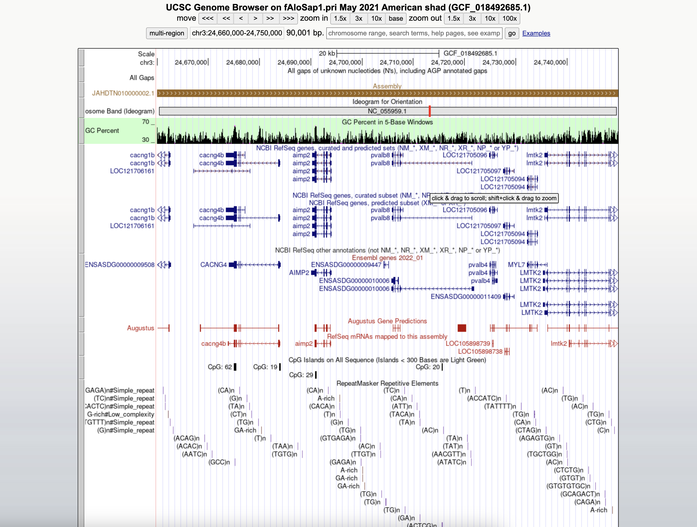

```{r libraries, echo = FALSE}
library(tidyverse)
library(gt)
library(ggtext)
```

```{r sanadxnanad, echo = FALSE}
cols <- c("region", "chr", "midPos", "Nsites", "Fst")
data <- read_delim("data/SANAD--x--NANAD--size-50000--step-10000.tsv", 
                   skip = 2,
                   delim = "\t",
                   col_names = cols)


data_cum <- data %>%
  group_by(chr) %>%
  summarise(max_pos = max(midPos)) %>%
  mutate(pos_add = lag(cumsum(max_pos), default = 0)) %>%
  select(chr, pos_add)

data <- data %>%
  inner_join(data_cum, by = "chr") %>%
  mutate(pos_cum = midPos + pos_add)

axis_set <- data %>%
  group_by(chr) %>%
  summarise(center = mean(pos_cum))


plot <- ggplot(data = data,
               mapping = aes(x = pos_cum,
                             y = Fst,
                             color = as_factor(chr),
                             size = Fst)) +
  geom_point(alpha = 0.75) +
  scale_x_continuous(label = axis_set$chr,
                     breaks = axis_set$center) +
  scale_y_continuous(expand = c(0,0),
                     limits = c(-0.05, 1)) +
  scale_color_manual(values = rep(c("#242b35", "#869ca8"),
                                  unique(length(axis_set$chr)))) +
  scale_size_continuous(range = c(0.5, 3)) +
  labs(x = NULL,
       y = "Fst",
       title = "Southern Anadromous versus Northern Anadromous Samples") +
  theme_minimal() +
  theme(legend.position = "none",
        panel.grid.major.x = element_blank(),
        panel.grid.minor.x = element_blank(),
        axis.title.y = element_markdown(),
        axis.text.x = element_text(angle = 90,
                                  size = 8,
                                  vjust = 0.5))
plot


chrom3 <- filter(data, chr == "NC_055959.1")

chr3_plot <- ggplot(data = chrom3,
                    mapping = aes(x = pos_cum,
                                  y = Fst,
                                  size = Fst,
                                  color = "#242b35")) +
  geom_point(alpha = 0.75) +
  scale_size_continuous(range = c(0.5, 3)) +
  scale_color_manual(values = "#242b35") +
  scale_y_continuous(expand = c(0,0), limits = c(-0.05, 1)) +
  labs(x = "Position", 
       y = "Fst") +
  theme_minimal() +
  theme(legend.position = "none",
        panel.grid.major.x = element_blank(),
        panel.grid.minor.x = element_blank(),
        axis.title.y = element_markdown(),
        axis.text.x = element_text(angle = 60, 
                                   size = 8, 
                                   vjust = 0.5))
chr3_plot


spike <- filter(chrom3, Fst > 0.15)
spike_plot <- ggplot(data = spike,
                    mapping = aes(x = pos_cum,
                                  y = Fst,
                                  size = Fst,
                                  color = "#242b35")) +
  geom_point(alpha = 0.75) +
  scale_size_continuous(range = c(0.5, 3)) +
  scale_color_manual(values = "#242b35") +
  scale_y_continuous(expand = c(0,0), limits = c(-0.05, 1)) +
  labs(x = "Position", 
       y = "Fst") +
  theme_minimal() +
  theme(legend.position = "none",
        panel.grid.major.x = element_blank(),
        panel.grid.minor.x = element_blank(),
        axis.title.y = element_markdown(),
        axis.text.x = element_text(angle = 60, 
                                   size = 8, 
                                   vjust = 0.5))
spike_plot
```

This next set of figures were made using ANGSD Allele Frequency estimation. This was run with a known major and unknown minor, in which the unknown minor allele frequency is plotted on the y-axis. The major allele is assumed to be known (inferred or given by user) however the minor allele is not determined. Instead it is summed over the 3 possible minor alleles weighted by their probabilities. The allele frequency estimator from genotype likelihoods was done using the EM algorithm. Targeting chromosome 3, and further the specific region around 24,700,000 bp, was chosen based on the pairwise Fst sliding window plot above, where we see a spike at chromosome 3 in that particular region interesting in that previous studies found an average Fst of 0.008 when comparing Canadian to Southern New England or Mid-Atlantic samples, making the Fst values in this region magnitudes larger than expected. The last time the lab (Anthony) saw a peak such as this, it was the greb1l gene. All ANGSD runs also were referenced to the American shad genome.


```{r, echo = FALSE}
snps <- read.table("data/alewife-subset-w-ref_chr3.mafs", 
                   sep = "\t", 
                   header = T)

pvalb8 <- filter(snps, position > 24705779 & position < 24721464) %>%
  add_column(gene = "pvalb8") %>%
  select(position, gene)
pvalb4 <- filter(snps, position > 24724924 & position < 24726052)%>% 
  add_column(gene = "pvalb4") %>% 
  select(position, gene)
lmtk2 <- filter(snps, position > 24735624 & position < 24760089) %>%
  add_column(gene = "lmtk2") %>%
  select(position, gene)
myl7 <- filter(snps, position > 24732237 & position < 24736155) %>% 
  add_column(gene = "myl7") %>%
  select(position, gene)
aimp2 <- filter(snps, position > 24690228 & position < 24694028) %>% 
  add_column(gene = "aimp2") %>%
  select(position, gene)
cacng4b <- filter(snps, position > 24673418 & position < 24683977) %>%
  add_column(gene = "cacng4b") %>%
  select(position, gene)
cacng1b <- filter(snps, position > 24654400 & position < 24662666) %>%
  add_column(gene = "cacng1b") %>%
  select(position, gene)

genes <- bind_rows(pvalb4, pvalb8, lmtk2, myl7, aimp2, cacng1b, cacng4b)

snps <- left_join(snps, genes,
          by = c("position" = "position"))

gene_color <- c(`aimp2` = "#17263b",
                `cacng1b` = "#867095",
                `cacng4b` = "#536a5b",
                `lmtk2` = "#f5d2f1",
                `myl7` = "#504a5d",
                `pvalb4` = "#effeff",
                `pvalb8` = "#aad1f3")

ggplot(data = snps, 
       mapping = aes(y = unknownEM,
                     x = position, 
                     fill = gene)) +
  geom_point(alpha = 0.5, 
             shape = 21, 
             size = 1.5) +
  theme_bw() +
  theme(panel.grid.minor = element_blank()) +
  geom_point(size = 2,
             stroke = 0.05,
             alpha = 0.75, 
             shape = 21) +
  scale_fill_manual(values = gene_color)
```


The following figure is constrained on chromosome 3 to region 24,704,000-24,750,000.

```{r echo = FALSE}
snps <- read.table("data/alewife-subset-w-ref_247-247_region.mafs", 
                   sep = "\t", 
                   header = T)

pvalb8 <- filter(snps, position > 24705779 & position < 24721464) %>%
  add_column(gene = "pvalb8") %>%
  select(position, gene)
pvalb4 <- filter(snps, position > 24724924 & position < 24726052)%>% 
  add_column(gene = "pvalb4") %>% 
  select(position, gene)
lmtk2 <- filter(snps, position > 24735624 & position < 24760089) %>%
  add_column(gene = "lmtk2") %>%
  select(position, gene)
myl7 <- filter(snps, position > 24732237 & position < 24736155) %>% 
  add_column(gene = "myl7") %>%
  select(position, gene)
aimp2 <- filter(snps, position > 24690228 & position < 24694028) %>% 
  add_column(gene = "aimp2") %>%
  select(position, gene)
cacng4b <- filter(snps, position > 24673418 & position < 24683977) %>%
  add_column(gene = "cacng4b") %>%
  select(position, gene)
cacng1b <- filter(snps, position > 24654400 & position < 24662666) %>%
  add_column(gene = "cacng1b") %>%
  select(position, gene)

genes <- bind_rows(pvalb4, pvalb8, lmtk2, myl7, aimp2, cacng1b, cacng4b)

snps <- left_join(snps, genes,
          by = c("position" = "position"))

gene_color <- c(`aimp2` = "#17263b",
                `cacng1b` = "#867095",
                `cacng4b` = "#536a5b",
                `lmtk2` = "#f5d2f1",
                `myl7` = "#504a5d",
                `pvalb4` = "#effeff",
                `pvalb8` = "#aad1f3")

ggplot(data = snps, 
       mapping = aes(y = unknownEM,
                     x = position, 
                     fill = gene)) +
  geom_point(alpha = 0.5, 
             shape = 21, 
             size = 1.5) +
  theme_bw() +
  theme(panel.grid.minor = element_blank()) +
  geom_point(size = 2,
             stroke = 0.05,
             alpha = 0.75, 
             shape = 21) +
  scale_fill_manual(values = gene_color)
```

The following figure shows the allele frequencies on a broader range on chromosome 3 from 24,650,000-24,780,000 with a minimum minor allele frequency of 0.05.

```{r echo = FALSE}
snps <- read.table("data/alewife-subset-w-ref_spec-genes.mafs", 
                   sep = "\t", 
                   header = T)


pvalb8 <- filter(snps, position > 24705779 & position < 24721464) %>%
  add_column(gene = "pvalb8") %>%
  select(position, gene)
pvalb4 <- filter(snps, position > 24724924 & position < 24726052)%>% 
  add_column(gene = "pvalb4") %>% 
  select(position, gene)
lmtk2 <- filter(snps, position > 24735624 & position < 24760089) %>%
  add_column(gene = "lmtk2") %>%
  select(position, gene)
myl7 <- filter(snps, position > 24732237 & position < 24736155) %>% 
  add_column(gene = "myl7") %>%
  select(position, gene)
aimp2 <- filter(snps, position > 24690228 & position < 24694028) %>% 
  add_column(gene = "aimp2") %>%
  select(position, gene)
cacng4b <- filter(snps, position > 24673418 & position < 24683977) %>%
  add_column(gene = "cacng4b") %>%
  select(position, gene)
cacng1b <- filter(snps, position > 24654400 & position < 24662666) %>%
  add_column(gene = "cacng1b") %>%
  select(position, gene)

genes <- bind_rows(pvalb4, pvalb8, lmtk2, myl7, aimp2, cacng1b, cacng4b)

snps <- left_join(snps, genes,
          by = c("position" = "position"))

gene_color <- c(`aimp2` = "#17263b",
                `cacng1b` = "#867095",
                `cacng4b` = "#536a5b",
                `lmtk2` = "#f5d2f1",
                `myl7` = "#504a5d",
                `pvalb4` = "#effeff",
                `pvalb8` = "#aad1f3")

ggplot(data = snps, 
       mapping = aes(y = unknownEM,
                     x = position, 
                     fill = gene)) +
  geom_point(alpha = 0.5, 
             shape = 21, 
             size = 1.5) +
  theme_bw() +
  theme(panel.grid.minor = element_blank()) +
  geom_point(size = 2,
             stroke = 0.05,
             alpha = 0.75, 
             shape = 21) +
  scale_fill_manual(values = gene_color)
```

The following figure is similar to the previous, but contains all minor allele frequencies.

```{r echo = FALSE}
snps <- read.table("data/alewife-subset-w-ref_spec-genes-no-filt.mafs", 
                   sep = "\t", 
                   header = T)

pvalb8 <- filter(snps, position > 24705779 & position < 24721464) %>%
  add_column(gene = "pvalb8") %>%
  select(position, gene)
pvalb4 <- filter(snps, position > 24724924 & position < 24726052)%>% 
  add_column(gene = "pvalb4") %>% 
  select(position, gene)
lmtk2 <- filter(snps, position > 24735624 & position < 24760089) %>%
  add_column(gene = "lmtk2") %>%
  select(position, gene)
myl7 <- filter(snps, position > 24732237 & position < 24736155) %>% 
  add_column(gene = "myl7") %>%
  select(position, gene)
aimp2 <- filter(snps, position > 24690228 & position < 24694028) %>% 
  add_column(gene = "aimp2") %>%
  select(position, gene)
cacng4b <- filter(snps, position > 24673418 & position < 24683977) %>%
  add_column(gene = "cacng4b") %>%
  select(position, gene)
cacng1b <- filter(snps, position > 24654400 & position < 24662666) %>%
  add_column(gene = "cacng1b") %>%
  select(position, gene)

genes <- bind_rows(pvalb4, pvalb8, lmtk2, myl7, aimp2, cacng1b, cacng4b)

snps <- left_join(snps, genes,
          by = c("position" = "position"))

gene_color <- c(`aimp2` = "#17263b",
                `cacng1b` = "#867095",
                `cacng4b` = "#536a5b",
                `lmtk2` = "#f5d2f1",
                `myl7` = "#504a5d",
                `pvalb4` = "#effeff",
                `pvalb8` = "#aad1f3")

ggplot(data = snps, 
       mapping = aes(y = unknownEM,
                     x = position, 
                     fill = gene)) +
  geom_point(alpha = 0.5, 
             shape = 21, 
             size = 1.5) +
  theme_bw() +
  theme(panel.grid.minor = element_blank()) +
  geom_point(size = 2,
             stroke = 0.05,
             alpha = 0.75, 
             shape = 21) +
  scale_fill_manual(values = gene_color)
```

GRL:

The following two figures are the minor allele frequencies from only the Great Lakes and Finger Lakes samples, with the first being unfiltered for minimum allele frequency and the second having a minMaf of 0.05.

```{r echo = FALSE}
snps <- read.table("data/GRL-alewife-subset-w-ref_spec-genes-no-filt.mafs", 
                   sep = "\t", 
                   header = T)

pvalb8 <- filter(snps, position > 24705779 & position < 24721464) %>%
  add_column(gene = "pvalb8") %>%
  select(position, gene)
pvalb4 <- filter(snps, position > 24724924 & position < 24726052)%>% 
  add_column(gene = "pvalb4") %>% 
  select(position, gene)
lmtk2 <- filter(snps, position > 24735624 & position < 24760089) %>%
  add_column(gene = "lmtk2") %>%
  select(position, gene)
myl7 <- filter(snps, position > 24732237 & position < 24736155) %>% 
  add_column(gene = "myl7") %>%
  select(position, gene)
aimp2 <- filter(snps, position > 24690228 & position < 24694028) %>% 
  add_column(gene = "aimp2") %>%
  select(position, gene)
cacng4b <- filter(snps, position > 24673418 & position < 24683977) %>%
  add_column(gene = "cacng4b") %>%
  select(position, gene)
cacng1b <- filter(snps, position > 24654400 & position < 24662666) %>%
  add_column(gene = "cacng1b") %>%
  select(position, gene)

genes <- bind_rows(pvalb4, pvalb8, lmtk2, myl7, aimp2, cacng1b, cacng4b)

snps <- left_join(snps, genes,
          by = c("position" = "position"))

gene_color <- c(`aimp2` = "#17263b",
                `cacng1b` = "#867095",
                `cacng4b` = "#536a5b",
                `lmtk2` = "#f5d2f1",
                `myl7` = "#504a5d",
                `pvalb4` = "#effeff",
                `pvalb8` = "#aad1f3")

ggplot(data = snps, 
       mapping = aes(y = unknownEM,
                     x = position, 
                     fill = gene)) +
  geom_point(alpha = 0.5, 
             shape = 21, 
             size = 1.5) +
  theme_bw() +
  theme(panel.grid.minor = element_blank()) +
  geom_point(size = 2,
             stroke = 0.05,
             alpha = 0.75, 
             shape = 21) +
  scale_fill_manual(values = gene_color)

snps <- read.table("data/GRL-alewife-subset-w-ref_spec-genes.mafs", 
                   sep = "\t", 
                   header = T)

pvalb8 <- filter(snps, position > 24705779 & position < 24721464) %>%
  add_column(gene = "pvalb8") %>%
  select(position, gene)
pvalb4 <- filter(snps, position > 24724924 & position < 24726052)%>% 
  add_column(gene = "pvalb4") %>% 
  select(position, gene)
lmtk2 <- filter(snps, position > 24735624 & position < 24760089) %>%
  add_column(gene = "lmtk2") %>%
  select(position, gene)
myl7 <- filter(snps, position > 24732237 & position < 24736155) %>% 
  add_column(gene = "myl7") %>%
  select(position, gene)
aimp2 <- filter(snps, position > 24690228 & position < 24694028) %>% 
  add_column(gene = "aimp2") %>%
  select(position, gene)
cacng4b <- filter(snps, position > 24673418 & position < 24683977) %>%
  add_column(gene = "cacng4b") %>%
  select(position, gene)
cacng1b <- filter(snps, position > 24654400 & position < 24662666) %>%
  add_column(gene = "cacng1b") %>%
  select(position, gene)

genes <- bind_rows(pvalb4, pvalb8, lmtk2, myl7, aimp2, cacng1b, cacng4b)

snps <- left_join(snps, genes,
          by = c("position" = "position"))

gene_color <- c(`aimp2` = "#17263b",
                `cacng1b` = "#867095",
                `cacng4b` = "#536a5b",
                `lmtk2` = "#f5d2f1",
                `myl7` = "#504a5d",
                `pvalb4` = "#effeff",
                `pvalb8` = "#aad1f3")

ggplot(data = snps, 
       mapping = aes(y = unknownEM,
                     x = position, 
                     fill = gene)) +
  geom_point(alpha = 0.5, 
             shape = 21, 
             size = 1.5) +
  theme_bw() +
  theme(panel.grid.minor = element_blank()) +
  geom_point(size = 2,
             stroke = 0.05,
             alpha = 0.75, 
             shape = 21) +
  scale_fill_manual(values = gene_color)
```


SANAD:

The following two figures are the minor allele frequencies from only the South Atlantic Gulf and Mid-Atlantic samples, with the first being unfiltered for minimum allele frequency and the second having a minMaf of 0.05.

```{r echo = FALSE}
snps <- read.table("data/SANAD-alewife-subset-w-ref_spec-genes-no-filt.mafs", 
                   sep = "\t", 
                   header = T)

pvalb8 <- filter(snps, position > 24705779 & position < 24721464) %>%
  add_column(gene = "pvalb8") %>%
  select(position, gene)
pvalb4 <- filter(snps, position > 24724924 & position < 24726052)%>% 
  add_column(gene = "pvalb4") %>% 
  select(position, gene)
lmtk2 <- filter(snps, position > 24735624 & position < 24760089) %>%
  add_column(gene = "lmtk2") %>%
  select(position, gene)
myl7 <- filter(snps, position > 24732237 & position < 24736155) %>% 
  add_column(gene = "myl7") %>%
  select(position, gene)
aimp2 <- filter(snps, position > 24690228 & position < 24694028) %>% 
  add_column(gene = "aimp2") %>%
  select(position, gene)
cacng4b <- filter(snps, position > 24673418 & position < 24683977) %>%
  add_column(gene = "cacng4b") %>%
  select(position, gene)
cacng1b <- filter(snps, position > 24654400 & position < 24662666) %>%
  add_column(gene = "cacng1b") %>%
  select(position, gene)

genes <- bind_rows(pvalb4, pvalb8, lmtk2, myl7, aimp2, cacng1b, cacng4b)

snps <- left_join(snps, genes,
          by = c("position" = "position"))

gene_color <- c(`aimp2` = "#17263b",
                `cacng1b` = "#867095",
                `cacng4b` = "#536a5b",
                `lmtk2` = "#f5d2f1",
                `myl7` = "#504a5d",
                `pvalb4` = "#effeff",
                `pvalb8` = "#aad1f3")

ggplot(data = snps, 
       mapping = aes(y = unknownEM,
                     x = position, 
                     fill = gene)) +
  geom_point(alpha = 0.5, 
             shape = 21, 
             size = 1.5) +
  theme_bw() +
  theme(panel.grid.minor = element_blank()) +
  geom_point(size = 2,
             stroke = 0.05,
             alpha = 0.75, 
             shape = 21) +
  scale_fill_manual(values = gene_color)

snps <- read.table("data/SANAD-alewife-subset-w-ref_spec-genes.mafs", 
                   sep = "\t", 
                   header = T)

pvalb8 <- filter(snps, position > 24705779 & position < 24721464) %>%
  add_column(gene = "pvalb8") %>%
  select(position, gene)
pvalb4 <- filter(snps, position > 24724924 & position < 24726052)%>% 
  add_column(gene = "pvalb4") %>% 
  select(position, gene)
lmtk2 <- filter(snps, position > 24735624 & position < 24760089) %>%
  add_column(gene = "lmtk2") %>%
  select(position, gene)
myl7 <- filter(snps, position > 24732237 & position < 24736155) %>% 
  add_column(gene = "myl7") %>%
  select(position, gene)
aimp2 <- filter(snps, position > 24690228 & position < 24694028) %>% 
  add_column(gene = "aimp2") %>%
  select(position, gene)
cacng4b <- filter(snps, position > 24673418 & position < 24683977) %>%
  add_column(gene = "cacng4b") %>%
  select(position, gene)
cacng1b <- filter(snps, position > 24654400 & position < 24662666) %>%
  add_column(gene = "cacng1b") %>%
  select(position, gene)

genes <- bind_rows(pvalb4, pvalb8, lmtk2, myl7, aimp2, cacng1b, cacng4b)

snps <- left_join(snps, genes,
          by = c("position" = "position"))

gene_color <- c(`aimp2` = "#17263b",
                `cacng1b` = "#867095",
                `cacng4b` = "#536a5b",
                `lmtk2` = "#f5d2f1",
                `myl7` = "#504a5d",
                `pvalb4` = "#effeff",
                `pvalb8` = "#aad1f3")

ggplot(data = snps, 
       mapping = aes(y = unknownEM,
                     x = position, 
                     fill = gene)) +
  geom_point(alpha = 0.5, 
             shape = 21, 
             size = 1.5) +
  theme_bw() +
  theme(panel.grid.minor = element_blank()) +
  geom_point(size = 2,
             stroke = 0.05,
             alpha = 0.75, 
             shape = 21) +
  scale_fill_manual(values = gene_color)
```

NANAD:

The following two figures are the minor allele frequencies from only the Canadian and Northern New England samples, with the first being unfiltered for minimum allele frequency and the second having a minMaf of 0.05.

```{r echo = FALSE}
snps <- read.table("data/NANAD-alewife-subset-w-ref_spec-genes-no-filt.mafs", 
                   sep = "\t", 
                   header = T)

pvalb8 <- filter(snps, position > 24705779 & position < 24721464) %>%
  add_column(gene = "pvalb8") %>%
  select(position, gene)
pvalb4 <- filter(snps, position > 24724924 & position < 24726052)%>% 
  add_column(gene = "pvalb4") %>% 
  select(position, gene)
lmtk2 <- filter(snps, position > 24735624 & position < 24760089) %>%
  add_column(gene = "lmtk2") %>%
  select(position, gene)
myl7 <- filter(snps, position > 24732237 & position < 24736155) %>% 
  add_column(gene = "myl7") %>%
  select(position, gene)
aimp2 <- filter(snps, position > 24690228 & position < 24694028) %>% 
  add_column(gene = "aimp2") %>%
  select(position, gene)
cacng4b <- filter(snps, position > 24673418 & position < 24683977) %>%
  add_column(gene = "cacng4b") %>%
  select(position, gene)
cacng1b <- filter(snps, position > 24654400 & position < 24662666) %>%
  add_column(gene = "cacng1b") %>%
  select(position, gene)

genes <- bind_rows(pvalb4, pvalb8, lmtk2, myl7, aimp2, cacng1b, cacng4b)

snps <- left_join(snps, genes,
          by = c("position" = "position"))

gene_color <- c(`aimp2` = "#17263b",
                `cacng1b` = "#867095",
                `cacng4b` = "#536a5b",
                `lmtk2` = "#f5d2f1",
                `myl7` = "#504a5d",
                `pvalb4` = "#effeff",
                `pvalb8` = "#aad1f3")

ggplot(data = snps, 
       mapping = aes(y = unknownEM,
                     x = position, 
                     fill = gene)) +
  geom_point(alpha = 0.5, 
             shape = 21, 
             size = 1.5) +
  theme_bw() +
  theme(panel.grid.minor = element_blank()) +
  geom_point(size = 2,
             stroke = 0.05,
             alpha = 0.75, 
             shape = 21) +
  scale_fill_manual(values = gene_color)

snps <- read.table("data/NANAD-alewife-subset-w-ref_spec-genes.mafs", 
                   sep = "\t", 
                   header = T)

pvalb8 <- filter(snps, position > 24705779 & position < 24721464) %>%
  add_column(gene = "pvalb8") %>%
  select(position, gene)
pvalb4 <- filter(snps, position > 24724924 & position < 24726052)%>% 
  add_column(gene = "pvalb4") %>% 
  select(position, gene)
lmtk2 <- filter(snps, position > 24735624 & position < 24760089) %>%
  add_column(gene = "lmtk2") %>%
  select(position, gene)
myl7 <- filter(snps, position > 24732237 & position < 24736155) %>% 
  add_column(gene = "myl7") %>%
  select(position, gene)
aimp2 <- filter(snps, position > 24690228 & position < 24694028) %>% 
  add_column(gene = "aimp2") %>%
  select(position, gene)
cacng4b <- filter(snps, position > 24673418 & position < 24683977) %>%
  add_column(gene = "cacng4b") %>%
  select(position, gene)
cacng1b <- filter(snps, position > 24654400 & position < 24662666) %>%
  add_column(gene = "cacng1b") %>%
  select(position, gene)

genes <- bind_rows(pvalb4, pvalb8, lmtk2, myl7, aimp2, cacng1b, cacng4b)

snps <- left_join(snps, genes,
          by = c("position" = "position"))

gene_color <- c(`aimp2` = "#17263b",
                `cacng1b` = "#867095",
                `cacng4b` = "#536a5b",
                `lmtk2` = "#f5d2f1",
                `myl7` = "#504a5d",
                `pvalb4` = "#effeff",
                `pvalb8` = "#aad1f3")

ggplot(data = snps, 
       mapping = aes(y = unknownEM,
                     x = position, 
                     fill = gene)) +
  geom_point(alpha = 0.5, 
             shape = 21, 
             size = 1.5) +
  theme_bw() +
  theme(panel.grid.minor = element_blank()) +
  geom_point(size = 2,
             stroke = 0.05,
             alpha = 0.75, 
             shape = 21) +
  scale_fill_manual(values = gene_color)
```




```{r, echo = FALSE}
gene_desc <- read_tsv("gene-descriptions.tsv")
gt_tbl <- gt(gene_desc,
             rowname_col = "Gene")
gt_tbl <- gt_tbl |>
  tab_header(title = "Genes Within The Region of Interest",
             subtitle = "chr3:24,660,000-24,750,000") |>
  tab_source_note(source_note = "References") |>
  tab_source_note(source_note = "pvalb4: https://www.ncbi.nlm.nih.gov/gene/?term=Danio+rerio+pvalb4") |>
  tab_source_note(source_note = "pvalb8: https://www.ncbi.nlm.nih.gov/gene/?term=Danio+rerio+pvalb8") |>
  tab_source_note(source_note = "lmtk2: https://www.ncbi.nlm.nih.gov/gene/564666/") |>
  tab_source_note(source_note = "aimp2: https://www.ncbi.nlm.nih.gov/gene/406647") |>
  tab_source_note(source_note = "myl7: https://www.ncbi.nlm.nih.gov/gene/30592/") |>
  tab_source_note(source_note = "cacng4b: https://www.ncbi.nlm.nih.gov/gene/794222/") |>
  tab_source_note(source_note = "cacng1b: https://www.ncbi.nlm.nih.gov/gene/571193") |>
  sub_missing(columns = everything(),
              rows = everything(),
              missing_text = "") |>
  opt_row_striping()
gt_tbl
```
